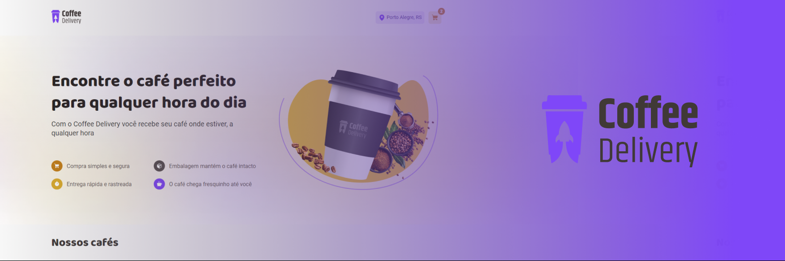

  
  
  
    
   
   

  
  
  

<h1 align="center">
    
</h1>

<h4 align="center"> 
	🚧  Coffee Delivery ♻️ Concluído 🚀 🚧
</h4>

 <a href="#-sobre-o-projeto">Sobre</a> •
 <a href="#-funcionalidades">Funcionalidades</a> •
 <a href="#-layout">Layout</a> • 
 <a href="#-como-executar-o-projeto">Como executar</a> • 
 <a href="#-tecnologias">Tecnologias</a> • 
 <a href="#-contribuidores">Contribuidores</a> • 
 <a href="#-autor">Autor</a> • 
 <a href="#user-content--licença">Licença</a>

## 💻 Sobre o projeto

Coffee Delivery - é uma plataforma de compra de café, onde o usuário pode indicar a quantidade mediante uma lista de opções, ir para o carrinho
informar o endereço e a forma de pagamento. 

Projeto frontend desenvolvido durante o curso online oferecido pela [Rocketseat].

---

## ⚙️ Funcionalidades

- [x] Pessoas podem entre as opções de cafés disponíveis na página inicial
	- Informar a quantidade por tipo
	- Alimentando o carrinho de compras
	- Encerrar o pedido
	- Informar o endereço
	- Informar a forma de pagamento
	- Finalizar na tela de conclusão do pedido e aguardar.

---

## 🎨 Layout

O layout da aplicação está disponível no Figma:

